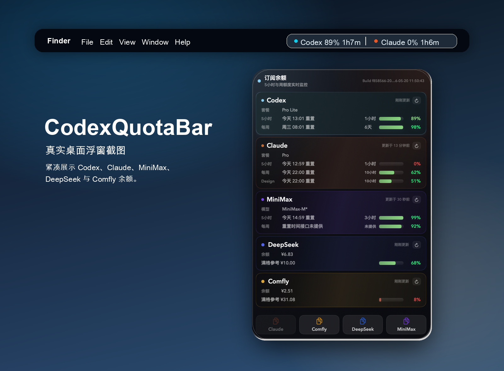
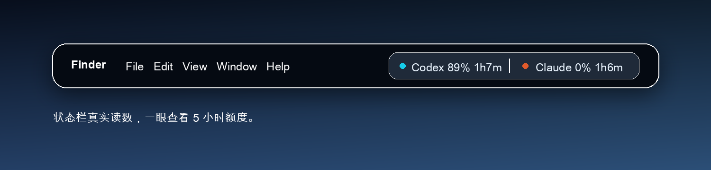

# CodexQuotaBar

Language: **English** | [简体中文](docs/i18n/README.zh-CN.md) | [日本語](docs/i18n/README.ja.md) | [한국어](docs/i18n/README.ko.md) | [Español](docs/i18n/README.es.md) | [Français](docs/i18n/README.fr.md) | [Deutsch](docs/i18n/README.de.md)

Native macOS menu bar app for showing Codex quota snapshots across one or more account slots.

## About / 关于

CodexQuotaBar is a small native macOS menu bar app for monitoring Codex quota without opening the Codex or ChatGPT UI. It silently imports your local Codex login, shows both the 5-hour and weekly windows, and keeps the detailed dashboard one click away.

CodexQuotaBar 是一个轻量的原生 macOS 状态栏应用，用来在不打开 Codex 或 ChatGPT 界面的情况下查看 Codex 额度。它会静默读取本机 Codex 登录状态，同时展示 5 小时额度和周额度，并提供一个精致的下拉仪表盘。

## Screenshots / 截图





## Features

- Compact macOS menu bar readout for 5-hour and weekly Codex quota.
- Glass-style popover dashboard with account, plan, refresh, and reset details.
- API key manager with one-click copy and balance snapshots for DeepSeek, MiniMax, and Comfly.
- Desktop WidgetKit widget for small and medium macOS widgets.
- Silent import from the local Codex login at `~/.codex/auth.json`.
- AIPlanMonitor-style profile and slot snapshot files for local inspection.
- DMG packaging script and generated app icons.

## Build

```sh
make build
make test
make app
```

The app bundle is written to:

```text
.build/CodexQuotaBar.app
```

## Runtime data

- Snapshot JSON: `~/Library/Application Support/CodexQuotaBar/codex_slots.json`
- Imported profile JSON: `~/Library/Application Support/CodexQuotaBar/codex_profiles.json`
- API key config JSON: `~/Library/Application Support/CodexQuotaBar/api_keys.json`
- Keychain mirror: macOS Keychain service `com.codexquotabar.secrets`

`Import Current Codex Account` reads `~/.codex/auth.json` and stores an AIPlanMonitor-style profile containing `authJSON`, account identity fields, slot id, and credential fingerprint. Tokens are also mirrored into Keychain so the provider can refresh without reparsing the profile file.

The API key config file stores provider templates, non-secret fields, and the last balance snapshot. DeepSeek/MiniMax API keys and the Comfly token are stored in Keychain, not in JSON.

Because `codex_profiles.json` contains imported auth JSON, keep the file private to your macOS user account.

## Install

```sh
make app
cp -R .build/CodexQuotaBar.app /Applications/
open /Applications/CodexQuotaBar.app
```

Or build a DMG installer:

```sh
make dmg
open .build/CodexQuotaBar.dmg
```

Then drag `CodexQuotaBar.app` into `Applications`.

If macOS blocks the unsigned app, open **System Settings -> Privacy & Security** and allow it, or run:

```sh
xattr -dr com.apple.quarantine /Applications/CodexQuotaBar.app
open /Applications/CodexQuotaBar.app
```

## Desktop widget

CodexQuotaBar includes two desktop-widget paths:

- A built-in floating desktop widget that works from the menu bar app. Open the popover and click `桌面`.
- An experimental WidgetKit extension bundled in the app. This may require a properly signed Xcode/Developer ID build before macOS lists it in the system widget gallery.

For the floating widget:

1. Launch CodexQuotaBar.
2. Open the status bar popover.
3. Click `桌面` to show or hide the desktop widget.

For the WidgetKit widget:

1. Install `CodexQuotaBar.app` into `/Applications`.
2. Launch the app once so it can write the latest quota snapshot.
3. Open macOS widgets from the desktop or Notification Center.
4. Search for `Codex 额度` or `CodexQuotaBar`.
5. Add the small or medium widget.

The widget reads the local snapshot written by the menu bar app. If the widget does not appear immediately after installing a local unsigned build, quit and reopen CodexQuotaBar, or log out and back in so macOS refreshes its widget extension cache.

## Provider configuration

The official Codex quota endpoint is isolated behind `OfficialCodexProvider` because OpenAI does not document a stable public subscription-quota API for this use case. Override endpoints without touching UI code:

```sh
CODEX_QUOTA_ENDPOINT="https://chatgpt.com/backend-api/wham/usage" \
OPENAI_OAUTH_TOKEN_ENDPOINT="https://auth.openai.com/oauth/token" \
swift run CodexQuotaBar
```
