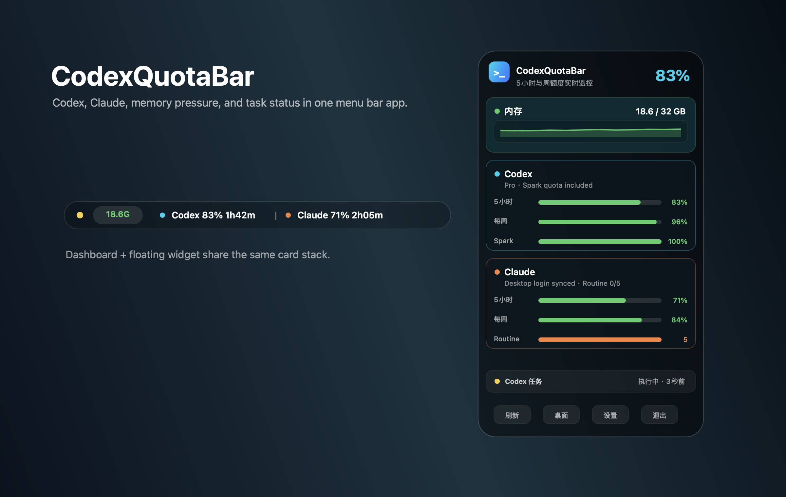
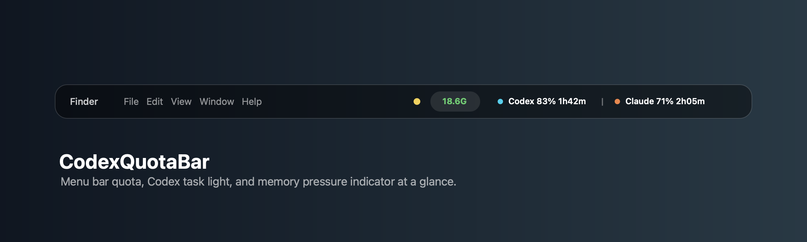

# CodexQuotaBar

语言： [English](../../README.md) | **简体中文** | [日本語](README.ja.md) | [한국어](README.ko.md) | [Español](README.es.md) | [Français](README.fr.md) | [Deutsch](README.de.md)

CodexQuotaBar 是一个原生 macOS 状态栏应用，用于集中展示 Codex、Claude、API 余额、内存压力和 Codex 任务状态。

## 关于 / About

CodexQuotaBar 是一个轻量的原生 macOS 状态栏应用，用来在不打开各个服务界面的情况下查看 AI 使用状态。它会导入本机 Codex 登录、同步 Claude Desktop 用量、展示 API 余额卡片、跟踪内存压力，并从 Codex 会话日志里显示任务状态。

CodexQuotaBar is a small native macOS menu bar app for monitoring AI usage without opening each provider UI. It imports your local Codex login, syncs Claude Desktop usage, shows API balance cards, tracks memory pressure, and surfaces Codex task activity from session logs.

## 截图 / Screenshots





## 功能

- 在 macOS 状态栏自定义显示 Codex、Claude、MiniMax 或任意组合。
- 下拉面板和悬浮桌面浮窗复用同一套卡片，展示 Codex、Claude、API 余额与内存状态。
- Codex 官方额度同步支持 OAuth 自动续期，并补充显示 Spark 额度。
- Claude Desktop 用量同步支持完整 cookie 注入、Electron UA 和 Routine 次数解析。
- Codex 任务红绿灯来自 `~/.codex/sessions/*.jsonl`，显示执行中、已完成或异常。
- 原生 Mach/sysctl 内存压力指示器，带 60 秒平滑折线。
- API Key 管理器，支持一键复制、余额展示，以及 DeepSeek/MiniMax/Comfly 使用统计。
- 本地安全持久化：密钥留在 Keychain，JSON 文件只保存元数据和快照。
- 提供 DMG 打包脚本、自动生成的应用图标和文档截图。

## 构建

```sh
make build
make test
make app
```

应用包输出到：

```text
.build/CodexQuotaBar.app
```

## 安装

```sh
make app
cp -R .build/CodexQuotaBar.app /Applications/
open /Applications/CodexQuotaBar.app
```

也可以生成 DMG：

```sh
make dmg
open .build/CodexQuotaBar.dmg
```

打开 DMG 后，将 `CodexQuotaBar.app` 拖入 `Applications`。

如果 macOS 拦截未签名应用，可以在 **系统设置 -> 隐私与安全性** 中允许，或执行：

```sh
xattr -dr com.apple.quarantine /Applications/CodexQuotaBar.app
open /Applications/CodexQuotaBar.app
```

## 桌面组件

CodexQuotaBar 提供两种桌面组件方式：

- 内置悬浮桌面组件：从状态栏下拉面板点击 `桌面` 即可显示或隐藏，当前 DMG 可直接使用。
- 实验性 WidgetKit 系统组件：已打包进 App，但 macOS 可能要求 Xcode/Developer ID 正式签名后才会显示在系统组件库里。

悬浮桌面组件：

1. 启动 CodexQuotaBar。
2. 打开状态栏下拉面板。
3. 点击 `桌面` 显示或隐藏桌面组件。

WidgetKit 系统组件：

1. 将 `CodexQuotaBar.app` 安装到 `/Applications`。
2. 启动一次应用，让它写入最新额度快照。
3. 在桌面或通知中心打开 macOS 组件面板。
4. 搜索 `Codex 额度` 或 `CodexQuotaBar`。
5. 添加小尺寸或中尺寸组件。

组件读取状态栏应用写入的本地快照。如果本地未签名构建安装后没有立刻出现在组件列表中，请退出并重新打开 CodexQuotaBar，或注销后重新登录，让 macOS 刷新组件扩展缓存。

## 运行数据

- 额度快照：`~/Library/Application Support/CodexQuotaBar/codex_slots.json`
- 导入的账号档案：`~/Library/Application Support/CodexQuotaBar/codex_profiles.json`
- API Key 配置：`~/Library/Application Support/CodexQuotaBar/api_keys.json`
- 钥匙串镜像：macOS Keychain service `com.codexquotabar.secrets`

`导入当前账号` 会读取 `~/.codex/auth.json`，本地 profile 只保存账号身份字段、slot id 和 credential fingerprint。访问令牌会同步到钥匙串，普通 JSON 文件不再保存原始 auth JSON。导入逻辑会合并 id token 与 access token 的 claims，确保 `client_id` 能用于后续 OAuth 自动续期。

API Key 配置文件只保存平台模板、非敏感字段和最后一次余额快照。DeepSeek/MiniMax 的 API key、Comfly token 会保存到 Keychain，不会写入普通 JSON。

Claude 用量从 Claude Desktop 的本地登录态同步：应用会本地解密 Claude cookie，把完整 cookie 集注入隐藏 WKWebView，并使用匹配 Claude Desktop 的 Electron User-Agent，让 Cloudflare 绑定的 cookie 继续有效。

`codex_profiles.json` 现在按元数据文件设计；它仍然会暴露本机账号标识，建议只保存在自己的 macOS 用户账号下，不要上传或分享。

如果你有 Developer ID 证书，可以用稳定签名身份构建 DMG，减少 macOS 钥匙串反复弹窗：

```sh
CODESIGN_IDENTITY="Developer ID Application: Your Name (TEAMID)" make dmg
```

## Provider 配置

Codex 额度刷新逻辑封装在 `OfficialCodexProvider`。如需覆盖接口：

```sh
CODEX_QUOTA_ENDPOINT="https://chatgpt.com/backend-api/wham/usage" \
OPENAI_OAUTH_TOKEN_ENDPOINT="https://auth.openai.com/oauth/token" \
swift run CodexQuotaBar
```
